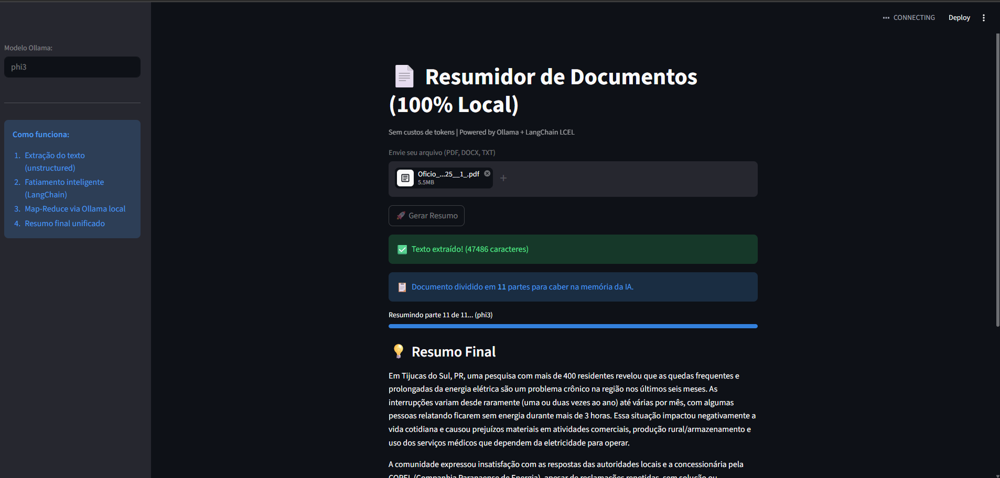

# 📄 Local Document Summarizer

Uma aplicação 100% local e segura para resumir documentos extensos (PDF, DOCX, TXT) utilizando Inteligência Artificial. Desenvolvida com **Streamlit**, **LangChain** e modelos locais via **Ollama**.
**Privacidade total**: nada sai da sua máquina, você não precisa de chaves de API pagas e seu documento não é usado para treinar modelos por empresas terceiras.



## 🚀 Funcionalidades
- **100% Offline e Privado**: O processamento e inferência são feitos localmente usando o Ollama. Nenhuma conexão com a internet é necessária durante o uso.
- **Suporte a Múltiplos Formatos**: Lê nativamente arquivos PDF, DOCX e TXT, e está programado com um sistema de extração resiliente 100% Python nativo.
- **Processamento de Grandes Textos**: Utiliza estratégias de "Chunking" (fatiamento de texto) recursivo e **Map-Reduce** do LangChain. Isso contorna completamente os limites de memória ou bloqueio de caracteres (context window) das IAs menores.
- **Flexibilidade Total de Modelos**: Permite escolher qual modelo do Ollama você quer usar livremente diretamente na interface lateral (`phi`, `llama3`, `mistral`, `gemma`, etc.). A troca de modelo é feita "as a service".

## 🛠️ Tecnologias Utilizadas
- **[Python](https://www.python.org/)** (Linguagem base)
- **[Streamlit](https://streamlit.io/)** (Framework reativo de Interface Gráfica Web)
- **[LangChain](https://www.langchain.com/) + LCEL** (Orquestração das chamadas ao LLM e pipes Map-Reduce)
- **[Ollama](https://ollama.com/)** (Servidor de inferência local)
- **Bibliotecas específicas**: `PyPDF2` (para extrair texto limpo de PDF) e `python-docx` (para arquivos do Word).

---

## ⚙️ Como Instalar e Rodar o Projeto

### 1. Pré-requisitos
* Ter o **Python** (versão 3.8 ou superior) instalado em sua máquina.
* Ter o **Ollama** instalado no seu computador ([baixar aqui](https://ollama.com/)).

### 2. Baixar um modelo no Ollama
O app foi estruturado de uma maneira que você pode rodar **Qualquer Modelo Local** que você tiver no seu Ollama. 
Abra o seu terminal/prompt de comando e baixe o modelo que deseja utilizar. Por padrão neste MVP a caixa vem preenchida com o `phi` (da Microsoft, que é bem leve e rápido):
```bash
ollama pull phi
```
> **💡 Sugestão**: Se você tem uma máquina um pouquinho melhor (ex: 8GB a 16GB de RAM), vale a pena testar com modelos maiores para resumos melhores, como o Llama 3 oficial da Meta:
> `ollama pull llama3`

### 3. Clonar o repositório e configurar ambiente
```bash
# Baixar os arquivos
git clone https://github.com/SEU-USUARIO-AQUI/local-doc-summarizer.git
cd local-doc-summarizer

# Criar um ambiente virtual para isolar as bibliotecas da sua máquina
python -m venv venv

# Ativar o ambiente virtual
# -> No Windows (Git Bash ou CMD):
venv\Scripts\activate
# -> No MacOS ou Linux do seu terminal:
source venv/bin/activate

# Instalar todas as dependências do Langchain e Streamlit
pip install -r requirements.txt
```

### 4. Iniciar a aplicação
Com o ambiente ativado, rode a aplicação abrindo o servidor do Streamlit:
```bash
streamlit run app.py
```
A interface será aberta automaticamente no seu navegador padrão (geralmente sob o endereço `http://localhost:8501`).

No menu lateral da aplicação web aberta, digite o nome do modelo que você baixou no Ollama na etapa 2 (ex: `Llama3` ou `phi`). Anexe seu arquivo e clique em Gerar!

---

## ❓ FAQ (Dúvidas Frequentes)

**1. Da maneira que está hoje, consigo utilizar com qualquer modelo do Ollama?**
Sim! Esse projeto foi codificado para ser "Agnóstico". Desde que você tenha baixado o modelo e ele esteja rodando no background na sua máquina (ex: se o comando `ollama run nome_do_modelo` funcionar), você só precisa digitar na barra lateral EXATAMENTE este nome, e a aplicação passará as instruções a ele de forma dinâmica via Langchain usando a rota padrão `localhost:11434`.

**2. A aplicação travou ou deu "Erro de conexão"!**
A maior causa disso é você ter colocado o Streamlit no ar, mas o aplicativo/serviço do Ollama estar desligado no seu computador. Abra o executável/app do Ollama no seu PC antes de enviar um documento.

---

## 🤝 Como Contribuir
Este é um projeto simples para resolução de leitura pesada offline. Se desejar, faça um **[Fork]**!
Melhorias envolvendo extração de OCR via Pytesseract para PDFs formato Imagem, ou novos templates de prompts "Reduction" mais técnicos para áreas (como Direito, Saúde, etc) são contribuições super bem-vindas.
1. Crie uma issue ou um Fork
2. Faça os seus commits (`git commit -m 'feat: Adicionando XYZ'`)
3. Abra seu Pull Request.

---
_Aproveite o tempo economizado na leitura para tomar um café ☕!_
